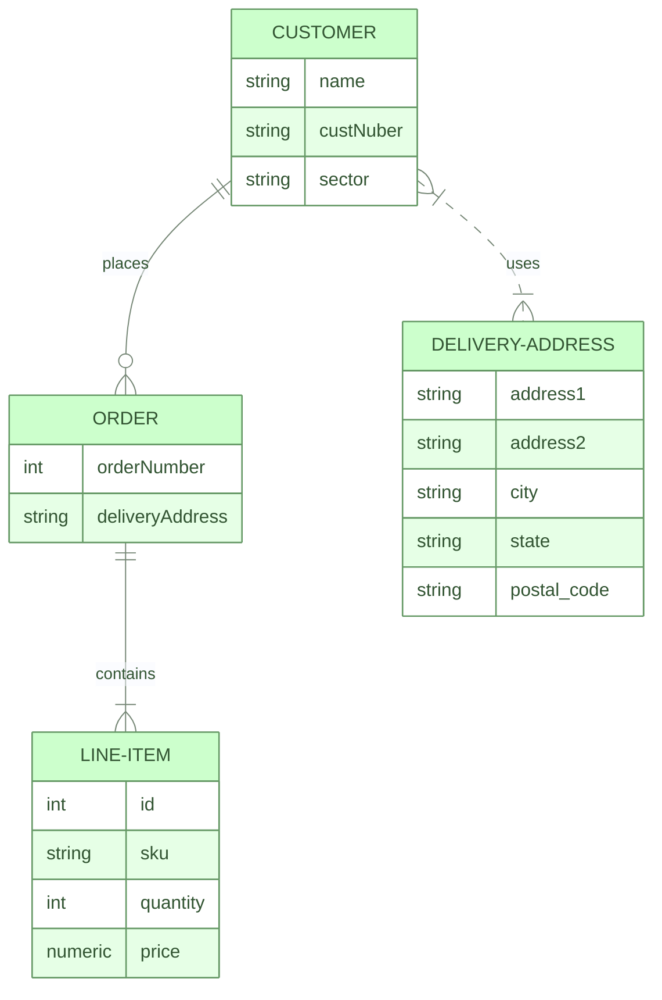
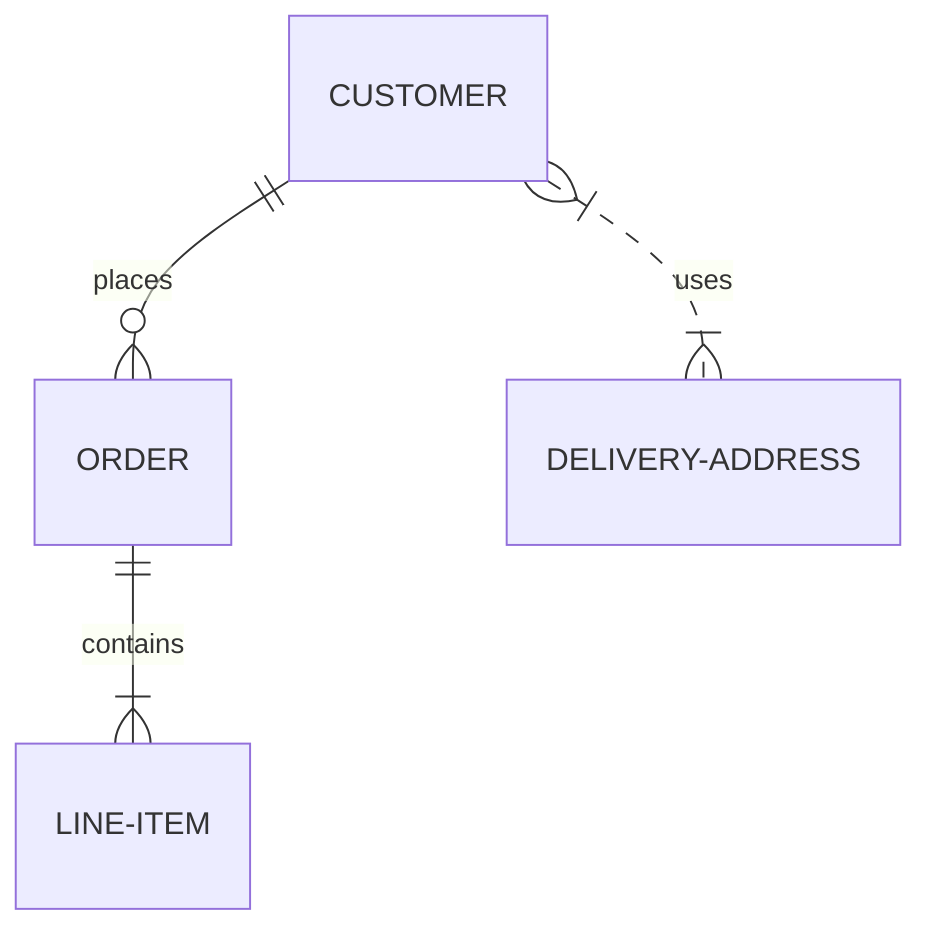
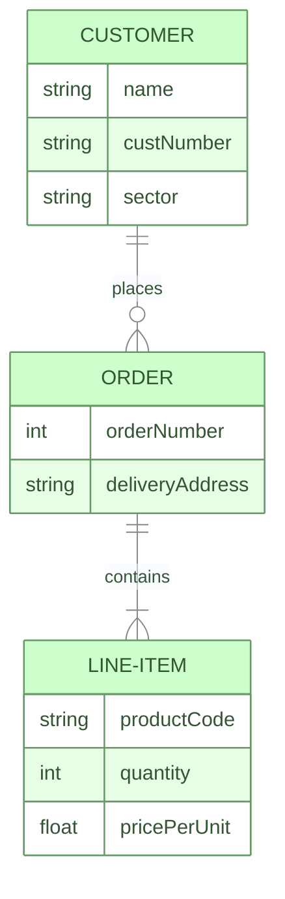
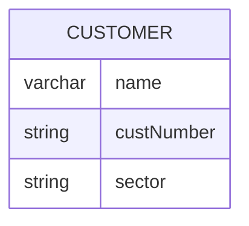

# sqldoc


```mermaid
%%{init: {'theme': 'base', 'themeVariables': {   
    'darkMode': false,
    'mainBkg': '#cfc',
    'primaryBorderColor': '#696',
    'primaryTextColor': '#353',
    'lineColor': '#787'
}}}%%
erDiagram
    CUSTOMER ||--o{ ORDER : places
    ORDER ||--|{ LINE-ITEM : contains
    CUSTOMER }|..|{ DELIVERY-ADDRESS : uses
    CUSTOMER {
        string name
        string custNuber
        string sector
    }
    ORDER {
        int orderNumber
        string deliveryAddress
    }
    DELIVERY-ADDRESS {
        string address1
        string address2
        string city
        string state
        string postal_code
    }
    LINE-ITEM {
        int id
        string sku
        int quantity
        numeric price
    }
```


```mermaid
erDiagram
    CUSTOMER ||--o{ ORDER : places
    ORDER ||--|{ LINE-ITEM : contains
    CUSTOMER }|..|{ DELIVERY-ADDRESS : uses
```


```mermaid
%%{init: {'theme': 'base', 'themeVariables': {   
    'darkMode': false,
    'mainBkg': '#cfc',
    'primaryBorderColor': '#696',
    'primaryTextColor': '#353',
    'lineColor': '#888'
}}}%%
erDiagram
    CUSTOMER ||--o{ ORDER : places
    CUSTOMER {
        string name
        string custNumber
        string sector
    }
    ORDER ||--|{ LINE-ITEM : contains
    ORDER {
        int orderNumber
        string deliveryAddress
    }
    LINE-ITEM {
        string productCode
        int quantity
        float pricePerUnit
    }
```

```mermaid
erDiagram
    CUSTOMER 
    CUSTOMER {
        varchar name
        string custNumber
        string sector
    }
```

insert code here

```sql
select * from table 1
```


